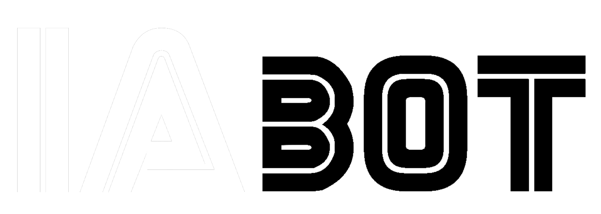

# IABOT - Cursos de Robótica en LEGO para Niños

Este repositorio contiene el código fuente de la página web de IABOT, una plataforma educativa que ofrece cursos de robótica en LEGO para niños. A través de nuestros cursos, los niños pueden aprender programación y resolución de problemas de una manera divertida y creativa.

## Características

- **Cursos de robótica en LEGO:** Ofrecemos una variedad de cursos de robótica utilizando el sistema LEGO. Los niños aprenderán los fundamentos de la robótica y la programación a través de proyectos prácticos y emocionantes.
- **Aprendizaje interactivo:** Nuestros cursos están diseñados para fomentar la participación activa de los estudiantes. Utilizamos enfoques prácticos y ejercicios interactivos para hacer que el aprendizaje sea divertido y efectivo.
- **Equipo altamente capacitado:** Contamos con un equipo de instructores altamente capacitados y apasionados por la enseñanza de la robótica a niños. Nuestros instructores tienen experiencia en la educación y están comprometidos en brindar una experiencia educativa de calidad.
- **Recursos pedagógicos:** Proporcionamos recursos pedagógicos completos para complementar los cursos. Los estudiantes tendrán acceso a materiales didácticos, guías de proyectos y ejercicios adicionales para reforzar su aprendizaje.
- **Ambiente amigable y seguro:** Nos esforzamos por crear un ambiente amigable y seguro para todos los estudiantes. Nuestro objetivo es que los niños se sientan cómodos y motivados para aprender y explorar el mundo de la robótica.

## Contenido del Repositorio

- `index.html`: Página principal de la plataforma web de IABOT.
- `css/`: Carpeta que contiene los archivos CSS utilizados para estilizar la página.
- `assets/`: Carpeta que contiene los recursos multimedia utilizados, como imágenes y fuentes.
- `js/`: Carpeta que contiene los archivos JavaScript utilizados para la funcionalidad interactiva de la página.

## Cómo Contribuir

Si desea contribuir a este proyecto, puede realizar los siguientes pasos:

1. Haga un fork de este repositorio y clone el fork a su máquina local.
2. Realice los cambios o mejoras deseadas en su copia local.
3. Haga commit de sus cambios y haga push a su repositorio fork.
4. Envíe un pull request a este repositorio para que revisemos sus cambios y los incorporemos al proyecto principal.

Agradecemos cualquier contribución que pueda realizar para mejorar nuestra plataforma educativa.

## Contacto

Si tiene alguna pregunta o consulta sobre nuestros cursos o plataforma, no dude en ponerse en contacto con nosotros.

- Sitio web: [www.iabot.com](https://www.iabot.com)
- Correo electrónico: roboticabot@gmail.com
- Teléfono: +54 9 2324 46-8366

¡Gracias por su interés en IABOT! Esperamos poder brindarles una experiencia educativa enriquecedora y divertida en el mundo de la robótica.
